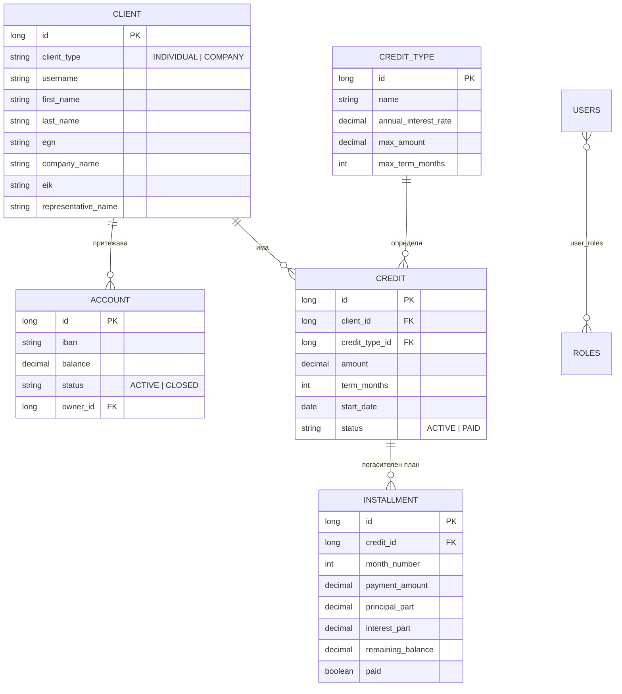

# Банкова система (Bank System)

Уеб приложение за управление на клиенти, банкови сметки и кредитни услуги, разработено
на **Java 21 / Spring Boot 3.3.4**. Проектът следва същата слоеста архитектура като
`medical-record`, но защитата е реализирана **само с локален вход** (form login от базата
данни), без Keycloak.

---

## 1. Използвани технологии

| Слой | Технология |
|------|-----------|
| Език / платформа | Java 21, Gradle |
| Framework | Spring Boot 3.3.4 |
| Достъп до данни | Spring Data JPA (Hibernate) |
| База данни | MySQL (релационна) |
| Презентация (GUI) | Thymeleaf + Bootstrap 5 + Font Awesome |
| Сигурност | Spring Security (локален form login, роли) |
| Валидация | Jakarta Bean Validation (`@NotBlank`, `@DecimalMin`, …) |
| Мапиране | ModelMapper + ръчни мапери |
| Намаляване на boilerplate | Lombok |
| Тестове | JUnit 5, Mockito, Spring MockMvc |

---

## 2. Структура на проекта

```
src/main/java/java_project_yn/bank_system
├── BankSystemApplication.java     – входна точка
├── config/                        – SecurityConfig, PasswordEncoderConfig
├── data/
│   ├── entity/                    – JPA модели (Client, Account, Credit, …)
│   └── repo/                      – Spring Data репозитории
├── dto/                           – обекти за пренос на данни (вход/изход)
├── exception/                     – изключения + REST и View хендлъри
├── service/ (+ impl/)             – бизнес логика (интерфейс + реализация)
├── util/                          – AnnuityCalculator, MapperUtil
└── web/
    ├── api/                       – REST контролери (/api/**)
    └── view/                      – Thymeleaf контролери
```

Архитектурата е разделена на три слоя: **презентационен** (`web` + Thymeleaf шаблони),
**бизнес логика** (`service`) и **слой за данни** (`data`). DTO-тата изолират входа/изхода
от вътрешните entity-та, а изключенията се обработват централизирано.

---

## 3. Схема на базата данни



**Клиентите** са моделирани чрез JPA наследяване (`SINGLE_TABLE` с дискриминатор
`client_type`): абстрактен `Client` с наследници `IndividualClient` (физическо лице) и
`CompanyClient` (юридическо лице).

---

## 4. Ключови компоненти на логиката

### Анюитетен погасителен план (`util/AnnuityCalculator`)
Сърцето на системата. Месечната вноска е постоянна:

```
A = P · r / (1 − (1 + r)⁻ⁿ)
```

където `P` е главницата, `r` — месечният лихвен процент (годишен / 12 / 100), `n` — срок в
месеци. За всеки месец лихвата се изчислява върху **оставащата** главница, която намалява;
в началото по-голяма част от вноската е лихва, към края — главница. Всички суми се водят в
`BigDecimal` (закръгляне HALF_UP, 2 знака), а последната вноска изравнява остатъка до 0.

### Отпускане на кредит (`CreditServiceImpl.grantCredit`)
Валидира сумата и срока спрямо лимитите на избрания вид кредит, създава кредита и
генерира целия погасителен план.

### Плащане на вноска (`CreditServiceImpl.payInstallment`)
Отбелязва вноска като платена (последователно), а при последна платена вноска маркира
кредита като `PAID`.

### Конфигурируеми видове кредит
Параметрите (лихва, макс. сума, макс. срок) се управляват от администратор през
`/credit-types`.

---

## 5. Роли и достъп

| Роля | Права |
|------|-------|
| `admin` | пълен достъп; управление на кредитни видове; изтриване на записи |
| `employee` | клиенти, сметки, кредити, погасяване на вноски |
| `client` | вижда само собствените си сметки, кредити и погасителни планове (`/my`) |

### Тестови акаунти (от `data.sql`)

| Потребител | Парола | Роля |
|-----------|--------|------|
| `admin` | `admin123` | admin |
| `employee` | `employee123` | employee |
| `client1` | `client123` | client |

---

## 6. Функционални изисквания (покритие)

| Изискване | Реализация |
|-----------|-----------|
| Добавяне на клиент | `ClientService.createIndividual / createCompany` |
| Откриване на сметка | `AccountService.openAccount` (авто-генериран IBAN) |
| Отпускане на кредит | `CreditService.grantCredit` |
| Генериране на погасителен план | `AnnuityCalculator.generate` (при отпускане) |
| Отбелязване на платена вноска | `CreditService.payInstallment` |
| Проверка на статус на кредит | детайл на кредита + статус `ACTIVE / PAID` |

---

## 7. Стартиране

Изисквания: **JDK 21** и работещ **MySQL** на `localhost`.

1. Настройте достъпа до базата в `src/main/resources/application.properties`
   (`spring.datasource.username` / `password`). Базата `bank-system` се създава автоматично.
2. Стартирайте: `./gradlew bootRun` (или Run от IntelliJ).
3. Отворете `http://localhost:8083` и влезте с някой от тестовите акаунти.

> Забележка: ако `./gradlew` липсва/не работи, отворете проекта в IntelliJ — то използва
> собствен Gradle и импортира проекта от `build.gradle`. При нужда генерирайте wrapper с
> `gradle wrapper --gradle-version 8.10`.

---

## 8. Тестове

`./gradlew test` изпълнява:

- `AnnuityCalculatorTest` — коректност на анюитетната формула (сбор на главниците = заема,
  остатък 0, намаляваща лихва, безлихвен случай);
- `*ServiceImplTest` — бизнес логика (валидации, генериране на план, статуси) с Mockito;
- `CreditApiControllerTest` — REST слой и права за достъп с MockMvc.

---

## 9. Източници

- Spring Boot Reference Documentation — https://docs.spring.io/spring-boot/
- Spring Security Reference — https://docs.spring.io/spring-security/reference/
- Spring Data JPA — https://docs.spring.io/spring-data/jpa/reference/
- Thymeleaf Documentation — https://www.thymeleaf.org/documentation.html
- Bootstrap 5 — https://getbootstrap.com/docs/5.3/
- Анюитетен метод на погасяване (amortized loan) — https://en.wikipedia.org/wiki/Amortization_calculator

---

## 10. Принос на участниците в екипа

> Попълнете според разпределението във вашия екип, напр.:
>
> - **Участник 1** — модели и слой за данни, схема на БД
> - **Участник 2** — бизнес логика, анюитетен калкулатор, тестове
> - **Участник 3** — презентационен слой (Thymeleaf), сигурност, документация
