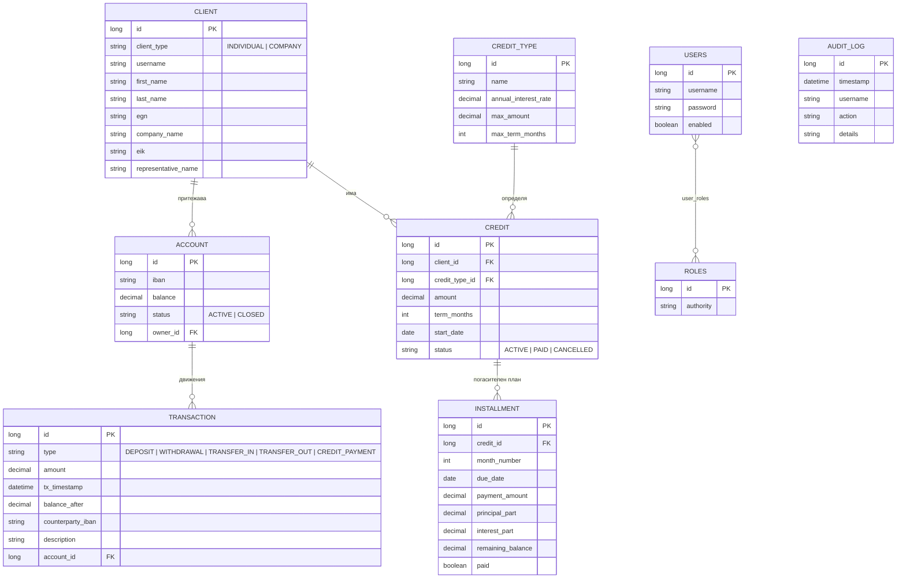

# Банкова система (Bank System)

Уеб приложение за управление на клиенти, банкови сметки и кредитни услуги, разработено
на **Java 21 / Spring Boot 3.3.4**. Слоеста архитектура; защитата е реализирана **само с
локален вход** (form login от базата данни), с роли `admin`, `employee` и `client`.

---

## 1. Използвани технологии

| Слой | Технология |
|------|-----------|
| Език / платформа | Java 21, Gradle |
| Framework | Spring Boot 3.3.4 |
| Достъп до данни | Spring Data JPA (Hibernate) |
| База данни | MySQL (релационна) |
| Презентация (GUI) | Thymeleaf + Bootstrap 5 + Font Awesome |
| Графики | Chart.js |
| Сигурност | Spring Security (локален form login, роли) |
| Валидация | Jakarta Bean Validation (`@NotBlank`, `@Pattern`, `@DecimalMin`, …) |
| Мапиране | ModelMapper + ръчни мапери |
| Намаляване на boilerplate | Lombok |
| Тестове | JUnit 5, Mockito, Spring MockMvc |

---

## 2. Структура на проекта

```
src/main/java/java_project_yn/bank_system
├── BankSystemApplication.java     – входна точка
├── config/                        – SecurityConfig, PasswordEncoderConfig, LoginAuditListener
├── data/
│   ├── entity/                    – JPA модели (Client, Account, Credit, Transaction, AuditLog, …)
│   └── repo/                      – Spring Data репозитории
├── dto/                           – обекти за пренос на данни (вход/изход)
├── exception/                     – изключения + REST и View хендлъри
├── service/ (+ impl/)             – бизнес логика (интерфейс + реализация)
├── util/                          – AnnuityCalculator, MapperUtil
└── web/
    ├── api/                       – REST контролери (/api/**)
    └── view/                      – Thymeleaf контролери
```

Архитектурата е разделена на три слоя: **презентационен** (`web` + Thymeleaf шаблони),
**бизнес логика** (`service`) и **слой за данни** (`data`). DTO-тата изолират входа/изхода
от вътрешните entity-та, а изключенията се обработват централизирано (отделни advice-и за
REST и за view слоя).

---

## 3. Схема на базата данни



**Клиентите** са моделирани чрез JPA наследяване (`SINGLE_TABLE` с дискриминатор
`client_type`): абстрактен `Client` с наследници `IndividualClient` (физическо лице) и
`CompanyClient` (юридическо лице). Триенето е каскадно: клиент → сметки → транзакции и
клиент → кредити → вноски.

---

## 4. Ключови компоненти на логиката

### Анюитетен погасителен план (`util/AnnuityCalculator`)
Сърцето на системата. Месечната вноска е постоянна:

```
A = P · r / (1 − (1 + r)⁻ⁿ)
```

където `P` е главницата, `r` — месечният лихвен процент (годишен / 12 / 100), `n` — срок в
месеци. За всеки месец лихвата се изчислява върху **оставащата** главница, която намалява;
в началото по-голяма част от вноската е лихва, към края — главница. Всички суми се водят в
`BigDecimal` (закръгляне HALF_UP, 2 знака), а последната вноска изравнява остатъка до 0.

### Кредити (`CreditServiceImpl`)
- **Отпускане** — валидира сумата/срока спрямо лимитите на вида кредит, създава кредита и
  генерира целия план (с падежи на вноските).
- **Плащане на вноска** — два пътя: служителско „маркиране" (касово) и **плащане от сметка**
  (атомарно теглене + маркиране, със запис на транзакция).
- **Предсрочно погасяване**, **отказ** (само ако няма платени вноски), **просрочие**
  (вноска с минал падеж).

### Транзакции (`TransactionServiceImpl`)
Депозит, теглене, превод между сметки (всичко `@Transactional`, с проверки за активна
сметка, достатъчна наличност, собственост при клиент). Всяко движение се записва в история.

### Сигурност и валидация
Локален form login с BCrypt; роли чрез `@PreAuthorize` на service методите + URL правила.
Bean Validation навсякъде (вкл. числови шаблони за ЕГН/ЕИК); централизирана обработка на
изключения; CSRF включен за формите, изключен само за `/api/**`.

### Журнал (Audit log)
Ключовите действия и успешните влизания се записват в `audit_log` и се преглеждат от admin.

---

## 5. Роли и достъп

| Роля | Права |
|------|-------|
| `admin` | пълен достъп; кредитни видове, служители, журнал; изтриване на записи |
| `employee` | клиенти, сметки, кредити, транзакции, погасяване на вноски |
| `client` | вижда само своите сметки/кредити; теглене, превод и плащане на вноски по своите сметки (`/my`) |

### Тестови акаунти (от `data.sql`)

| Потребител | Парола | Роля |
|-----------|--------|------|
| `admin` | `admin123` | admin |
| `employee` | `employee123` | employee |
| `client1` | `client123` | client |

---

## 6. Функционални изисквания (покритие)

| Изискване | Реализация |
|-----------|-----------|
| Добавяне на клиент | `ClientService.createIndividual / createCompany` |
| Откриване на сметка | `AccountService.openAccount` (авто-генериран IBAN) |
| Отпускане на кредит | `CreditService.grantCredit` |
| Генериране на погасителен план | `AnnuityCalculator.generate` (при отпускане) |
| Отбелязване на платена вноска | `CreditService.payInstallment` |
| Проверка на статус на кредит | детайл на кредита + статус `ACTIVE / PAID / CANCELLED` |

---

## 7. Допълнителни функционалности (над заданието)

- **Транзакции по сметки** — депозит, теглене, превод + история на движенията.
- **Онлайн банкиране за клиента** — клиентът сам прави теглене/превод и плаща вноски от своите сметки.
- **Кредитен калкулатор** на формата за отпускане (жив преглед на вноската/общата лихва).
- **Предсрочно погасяване, отказ на кредит, падежи и просрочие.**
- **Справки** с обобщени числа и графика (Chart.js).
- **Търсене и филтриране** по клиенти, сметки и кредити.
- **Профил + смяна на парола** и **тъмен режим** (запазен в браузъра).
- **Управление на служители** (създаване/деактивиране/изтриване) от admin.
- **Audit журнал** на действията и влизанията.
- **Вход за юридически лица** (парола при създаване от служител).
- REST API за всички ресурси, успоредно на уеб интерфейса.

---

## 8. Стартиране

Изисквания: **JDK 21** и работещ **MySQL** на `localhost`.

1. Настройте достъпа до базата в `src/main/resources/application.properties`
   (`spring.datasource.username` / `password`). Базата `bank-system` се създава автоматично.
2. Стартирайте: `./gradlew bootRun` (или Run от IntelliJ).
3. Отворете `http://localhost:8083` и влезте с някой от тестовите акаунти.

> Забележка: ако `./gradlew` липсва/не работи, отворете проекта в IntelliJ — то използва
> собствен Gradle и импортира проекта от `build.gradle`. При нужда генерирайте wrapper с
> `gradle wrapper --gradle-version 8.10`.

---

## 9. Тестове

`./gradlew test` изпълнява unit и slice тестове (без нужда от MySQL — REST тестовете ползват
MockMvc, service тестовете — Mockito):

- `AnnuityCalculatorTest` — коректност на анюитетната формула (сбор на главниците = заема,
  остатък 0, намаляваща лихва, безлихвен случай);
- `*ServiceImplTest` — бизнес логика на всички услуги (клиенти, сметки, транзакции, кредити,
  кредитни видове, потребители/служители, регистрация, статистика, журнал), вкл. валидации,
  собственост, генериране на план и статуси;
- `*ApiControllerTest` — REST слой и права за достъп с MockMvc (вкл. формат на грешките).

Ръчният сценарий за проверка е в `TESTING-CHECKLIST.md`.

---

## 10. Източници

- Spring Boot Reference Documentation — https://docs.spring.io/spring-boot/
- Spring Security Reference — https://docs.spring.io/spring-security/reference/
- Spring Data JPA — https://docs.spring.io/spring-data/jpa/reference/
- Thymeleaf Documentation — https://www.thymeleaf.org/documentation.html
- Bootstrap 5 — https://getbootstrap.com/docs/5.3/
- Chart.js — https://www.chartjs.org/docs/latest/
- Анюитетен метод на погасяване (amortized loan) — https://en.wikipedia.org/wiki/Amortization_calculator

---

## 11. Принос на участниците в екипа

> Попълнете според разпределението във вашия екип, напр.:
>
> - **Участник 1** — модели и слой за данни, схема на БД
> - **Участник 2** — бизнес логика, анюитетен калкулатор, транзакции, тестове
> - **Участник 3** — презентационен слой (Thymeleaf), сигурност, документация
